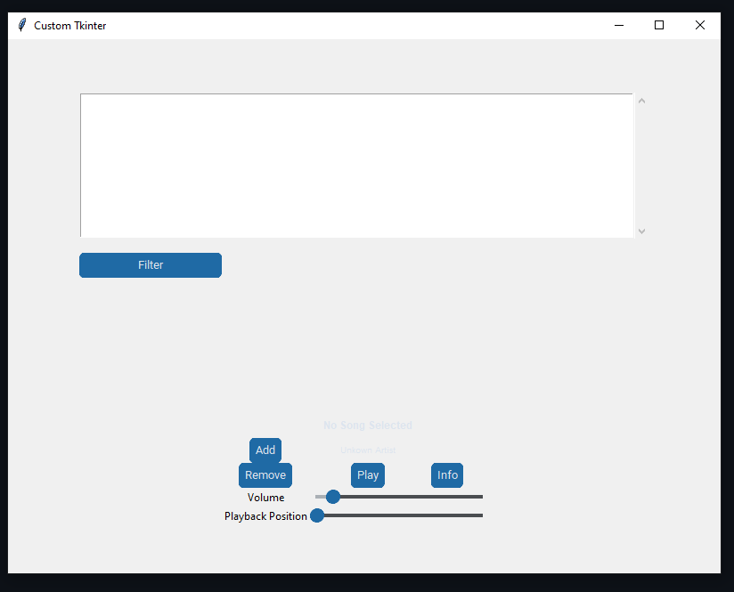

# S-Wave

## About

Welcome to S-Wave, a project developed as part of the Programming for Data Science course at the University of Bern. S-Wave is a music playing platform designed to put the user in complete control of their music experience. With S-Wave, users can upload their own *.mov* files, creating a personalized music library. Not only can users upload music files, but they can also add metadata such as artist name, genre, release year, and more, allowing for easy organization and filtering of their library.

S-Wave goes beyond being just a storage platform. It provides a user-friendly GUI with intuitive features that allow users to not only play music but also personalize their listening experience. Users can amplify tracks and visualize soundwaves through plots, giving them a deeper connection to their favorite music.

## Getting Started

To get started with S-Wave, follow these steps:

1. Clone the S-Wave repository to your local machine.
    
    ```powershell
    git clone https://github.com/PythonDataScience24/Music-Player.git
    ```

2. Install the necessary dependencies listed in the requirements.txt file.

    ```powershell
    cd .\Music-Player\
    pip install -r requirements.txt
    ```

3. Run the main application file **GUI.py** in you terminal to launch S-Wave.  
    ```powershell
    cd .\src\
    python .\GUI.py
    ```
    This will open a tkinter GUI as a popup window.
    

4. Upload your *.wav* files and add metadata to create your personalized music library with the simple **Add** button in the GUI.
5. Play your music and enjoy.

## Key Resources

- **Python Libraries**: We utilize various Python libraries such as pandas, tkinter and matplotlib for data manipulation, visualization, and GUI development.
- **University of Bern**: This project is developed as part of the Programming for Data Science course at the University of Bern.
- **GitHub Repository**: The S-Wave GitHub repository contains the latest codebase, documentation, and instructions for installation and usage.

---

**Developed by:**  
For any inquiries or feedback, please contact  
[Christian Gafner](mailto:christian.gafner@students.unibe.ch), 
[Julien Chopin](mailto:julien.chopin@students.unibe.ch), 
[Massimiliano Vella](mailto:massimiliano.vella@students.unibe.ch), 
[Alexander Mlekus](mailto:alexander.mlekus@students.unibe.ch),